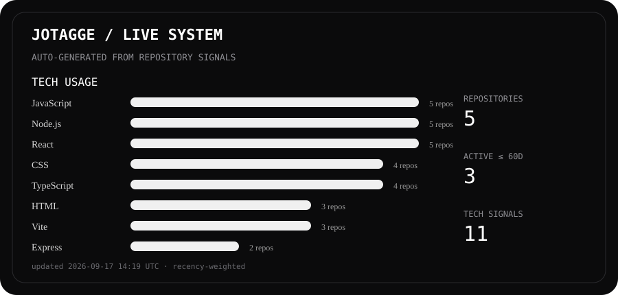

# José Gabriel Barros dos Santos

### Fullstack Developer · Product Builder · Creative Technologist

I build **software, systems and digital products** — from interfaces and frontend architecture to APIs, databases, backend systems and production deployments.

> I build systems. I design experiences. I create worlds.

  
  

---

<!-- DASHBOARD:START -->

  

### Current technology signal

> This section is generated automatically from my repositories. The first workflow run will replace this bootstrap state with live data.

### Recently active projects

| Project | Signal |
|---|---|
| Repository scanner | Waiting for first automated run |

<strong>How this dashboard works</strong>

A GitHub Action scans my owned repositories, inspects language data plus project manifests such as <code>package.json</code>, <code>pyproject.toml</code>, <code>requirements.txt</code>, <code>pom.xml</code>, <code>pubspec.yaml</code>, Docker files and infrastructure files, then regenerates this section, the SVG dashboard and <code>data/dashboard.json</code> automatically.

Private repositories are included only when the optional <code>PROFILE_DASHBOARD_TOKEN</code> repository secret is configured with read access to them. Without it, the dashboard safely analyzes public repositories only.

<!-- DASHBOARD:END -->

---

## ⚡ What I build

- Fullstack web applications
- APIs and backend systems
- Modern frontend architectures
- Mobile applications
- Digital products and internal tools
- Experimental software and prototypes
- Interfaces and digital experiences

---

## 🚀 Currently building

### BLUE LAB

An experimental technology and creative research laboratory focused on exploring ideas, building software, testing systems and turning concepts into functional experiments.

### NOMA

An independent design and technology practice focused on creating websites, digital products, systems and solutions for real-world businesses and projects.

### KRATOS

A fitness application exploring training, personal data and digital fitness experiences through mobile technology.

### BlueBoard

A fullstack application focused on product architecture, maintainability and the development of complete software systems.

---

## 🧪 Current areas of exploration

Software architecture · Fullstack product development · Backend systems and APIs · Mobile development · Cloud infrastructure · UI and digital experiences · Artificial intelligence · Experimental technology · Product thinking

---

## 🧭 My ecosystem

| Layer | Role |
|---|---|
| **JOTAGGE** | Personal archive and professional body of work — software, design, research, music, writing and experimentation. |
| **BLUE LAB** | Research, experimentation and exploration of technology, systems and new ideas. |
| **NOMA** | Commercial layer — turning design and technology into products and services for real-world clients. |

---

> Build. Learn. Break. Rebuild.
