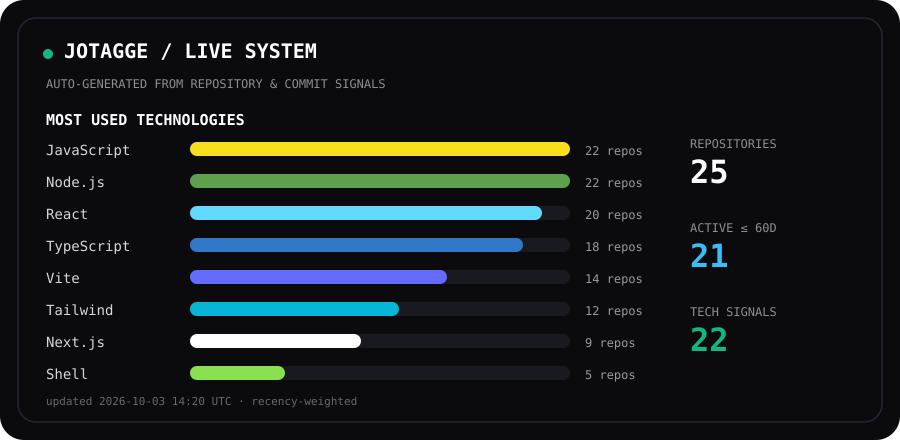

<!-- profile-refresh: 2026-09-09T05:24Z -->
# José Gabriel Barros dos Santos

### Fullstack Developer · Product Builder · Creative Technologist

I build **software, systems and digital products** — from interfaces and frontend architecture to APIs, databases, backend systems and production deployments.

> I build systems. I design experiences. I create worlds.

  
  

---

<!-- DASHBOARD:START -->

  

### 🚀 Últimos Projetos Commitados & Stack

| Repositório | Último Commit | Tecnologias Detectadas | Status |
| :--- | :--- | :--- | :---: |
| [**BLUELAB-SITE**](https://github.com/JOTAGGE/BLUELAB-SITE) `🔒 Privado` O Site da Bluelab | [`1c971e3`](https://github.com/JOTAGGE/BLUELAB-SITE/commit/1c971e3caa0b51ade2fe09e25404e8ee165f196a) · **11 Set 2026** 💬 *feat: add CrachaClientView component and supporti…* |      | 🟢 Ativo |
| [**ODUU-site**](https://github.com/JOTAGGE/ODUU-site) `🔒 Privado` | [`dac8241`](https://github.com/JOTAGGE/ODUU-site/commit/dac8241503cb96ed76aeb33f76f506b067aca988) · **10 Set 2026** 💬 *oduu site first commit* |      | 🟢 Ativo |
| [**happiptv**](https://github.com/JOTAGGE/happiptv) `🔒 Privado` | [`ec8a2fe`](https://github.com/JOTAGGE/happiptv/commit/ec8a2fe0270e61d99276c8c25e3d15f823927d9c) · **10 Set 2026** 💬 *ultimos ajustes* |   | 🟢 Ativo |
| [**OnDoubtUseUs-app**](https://github.com/JOTAGGE/OnDoubtUseUs-app) `🔒 Privado` The video and music Downloader  | [`61af704`](https://github.com/JOTAGGE/OnDoubtUseUs-app/commit/61af704a9662dd11e951a4a1b14720bfbbf61441) · **10 Set 2026** 💬 *mobile design correction* |      | 🟢 Ativo |
| [**KOS-app**](https://github.com/JOTAGGE/KOS-app) `🔒 Privado` | [`913778f`](https://github.com/JOTAGGE/KOS-app/commit/913778fea3efff452328af11e76b3034d8311b2f) · **09 Set 2026** 💬 *Merge pull request #1 from JOTAGGE/fix/review-eng…* |      | 🟢 Ativo |
| [**JOTTAGGE-DIGITAL-ARCHIVE-v1.0**](https://github.com/JOTAGGE/JOTTAGGE-DIGITAL-ARCHIVE-v1.0) `🔒 Privado` | [`6ce03f9`](https://github.com/JOTAGGE/JOTTAGGE-DIGITAL-ARCHIVE-v1.0/commit/6ce03f9ebdba87646d79cb5d6f80c62a030a2e12) · **05 Set 2026** 💬 *feat: implement administrative content management…* |      | 🟢 Ativo |
| [**NOMA-SITE**](https://github.com/JOTAGGE/NOMA-SITE) `🔒 Privado` O site da NOMA | [`6dc2ae3`](https://github.com/JOTAGGE/NOMA-SITE/commit/6dc2ae350dab260ebd1dc8451987294363e05b9f) · **29 Ago 2026** 💬 *adicionado modelo 2* |      | ⚡ Recente |
| [**MJ-COSTURAS**](https://github.com/JOTAGGE/MJ-COSTURAS) `🔒 Privado` | [`d457be8`](https://github.com/JOTAGGE/MJ-COSTURAS/commit/d457be853011ef703a58be093979bace5e28f63e) · **29 Ago 2026** 💬 *fix(social): update NOMA instagram to @nomaprojec…* |      | ⚡ Recente |
| [**BLUE-WEAR-SITE**](https://github.com/JOTAGGE/BLUE-WEAR-SITE) `🔒 Privado` | [`08dd652`](https://github.com/JOTAGGE/BLUE-WEAR-SITE/commit/08dd652b11405771869499a25ce5f2009aec8e40) · **29 Ago 2026** 💬 *feat: implement base global styles and landing pa…* |      | ⚡ Recente |
| [**STUDIO-PAULA-SITE**](https://github.com/JOTAGGE/STUDIO-PAULA-SITE) `🔒 Privado` | [`b1259f9`](https://github.com/JOTAGGE/STUDIO-PAULA-SITE/commit/b1259f9cd93dc1f5166651306f0961e9a26f9817) · **28 Ago 2026** 💬 *Modelo 1 NOMA* |      | ⚡ Recente |

### ⚡ Tecnologias em Frequência Ativa

           

> ℹ️ *Esta stack e histórico de projetos são **calculados dinamicamente** a partir dos repositórios, analisando código-fonte, manifestos (`package.json`, etc.) e os commits mais recentes.*

<strong>📊 Telemetria detalhada de tecnologias</strong> (expandir ranking completo)

| # | Tecnologia | Repositórios | Pontuação Ponderada |
|---:|---|---:|---:|
| 1 | **JavaScript** | 22 | 40 |
| 2 | **Node.js** | 22 | 40 |
| 3 | **CSS** | 20 | 38 |
| 4 | **React** | 20 | 37 |
| 5 | **TypeScript** | 18 | 35 |
| 6 | **Vite** | 14 | 27 |
| 7 | **HTML** | 12 | 22 |
| 8 | **Tailwind** | 12 | 22 |
| 9 | **Next.js** | 9 | 18 |
| 10 | **Shell** | 5 | 10 |
| 11 | **Java** | 4 | 8 |
| 12 | **Python** | 4 | 7 |
| 13 | **GitHub Actions** | 3 | 6 |
| 14 | **Express** | 3 | 5 |
| 15 | **FastAPI** | 3 | 5 |
| 16 | **Dart** | 2 | 4 |
| 17 | **Docker** | 2 | 4 |
| 18 | **Flutter** | 2 | 4 |
| 19 | **CSharp** | 1 | 2 |
| 20 | **Firebase** | 1 | 2 |
| 21 | **Prisma** | 1 | 2 |
| 22 | **Supabase** | 1 | 2 |

*A pontuação é ponderada por recência: projetos com commits nos últimos 14 dias possuem peso 3, até 60 dias possuem peso 2, e projetos mais antigos possuem peso 1.*

<strong>⚙️ Como funciona este dashboard automatizado</strong>

Um fluxo do GitHub Actions executa diariamente e a cada push, inspecionando os repositórios (incluindo privados quando o segredo <code>PROFILE_DASHBOARD_TOKEN</code> está configurado), analisando linguagens, manifestos de dependência e os últimos commits efetuados.

A partir desses dados, o script Node.js gera o SVG visual de telemetria, atualiza o arquivo de dados <code>data/dashboard.json</code> e reconstrói este bloco no <code>README.md</code> de forma 100% autônoma.

<!-- DASHBOARD:END -->

---

## ⚡ What I build

- Fullstack web applications
- APIs and backend systems
- Modern frontend architectures
- Mobile applications
- Digital products and internal tools
- Experimental software and prototypes
- Interfaces and digital experiences

---

## 🚀 Currently building

### BLUE LAB

An experimental technology and creative research laboratory focused on exploring ideas, building software, testing systems and turning concepts into functional experiments.

### NOMA

An independent design and technology practice focused on creating websites, digital products, systems and solutions for real-world businesses and projects.

### KRATOS

A fitness application exploring training, personal data and digital fitness experiences through mobile technology.

### BlueBoard

A fullstack application focused on product architecture, maintainability and the development of complete software systems.

---

## 🧪 Current areas of exploration

Software architecture · Fullstack product development · Backend systems and APIs · Mobile development · Cloud infrastructure · UI and digital experiences · Artificial intelligence · Experimental technology · Product thinking

---

## 🧭 My ecosystem

| Layer | Role |
|---|---|
| **JOTAGGE** | Personal archive and professional body of work — software, design, research, music, writing and experimentation. |
| **BLUE LAB** | Research, experimentation and exploration of technology, systems and new ideas. |
| **NOMA** | Commercial layer — turning design and technology into products and services for real-world clients. |

---

> Build. Learn. Break. Rebuild.
